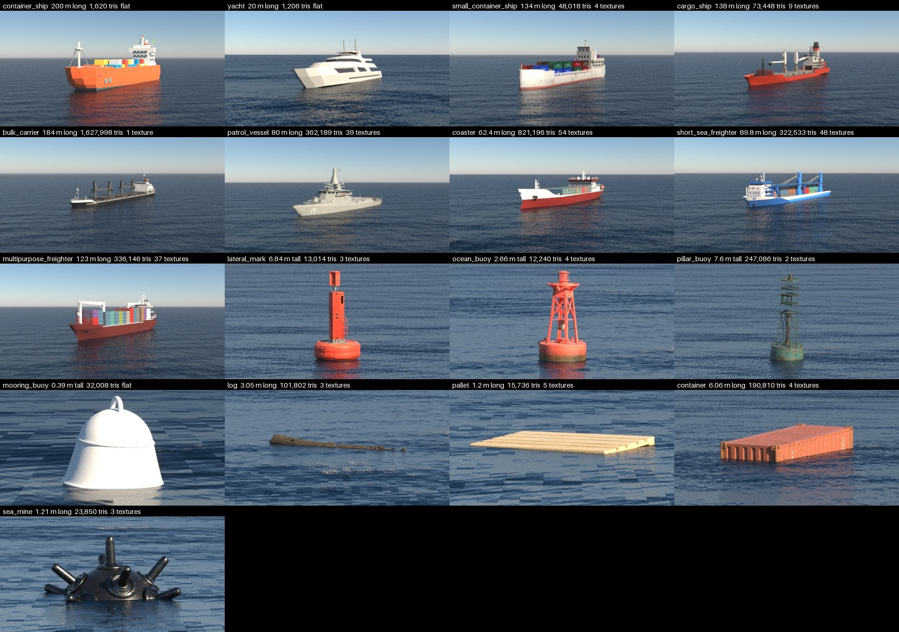
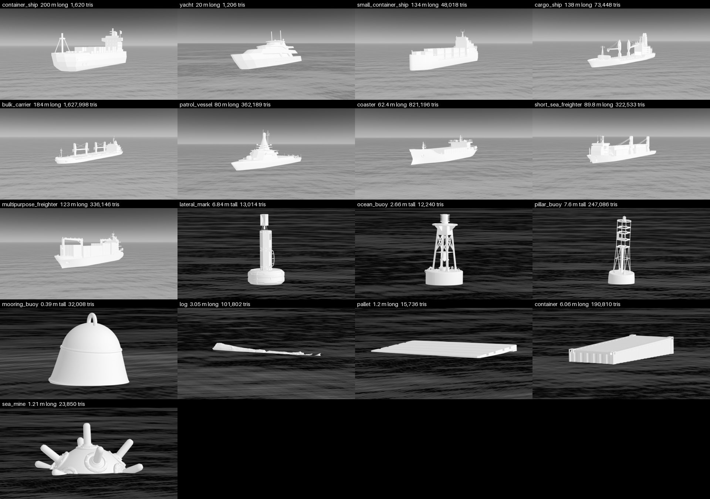

# Assets

Meshes are never committed. `seascape/assets.toml` records each one's source, sha256, licence and credit; they download on first use to `~/.cache/seascape`, or to `$XDG_CACHE_HOME/seascape` when that is set to an absolute path. Every run re-checks the digest. `seascape assets list` shows the meshes a scenario can name in `asset`, and the skies it can name in `sky.hdri`.

## Where a mesh may come from

A build downloads each mesh itself, so it needs URLs that anyone can fetch without logging in and that always return the same bytes. A `.glb` or `.fbx` holds its textures; a `.gltf` lists its buffer and textures under `files`, by the paths it names them. Prefer the sources top to bottom: Poly Haven's models are curated and come at real size.

| Source | Licence | The file's URL |
|---|---|---|
| [Poly Haven](https://polyhaven.com/models) | CC0 | The `gltf` entry of `api.polyhaven.com/files/<id>`, its `include` the `files` |
| [Objaverse](https://huggingface.co/datasets/allenai/objaverse) | Each model's own: take CC0 or CC-BY only | `resolve/<commit>/glbs/...`, pinned to a commit, never `main`; `object-paths.json.gz` maps a Sketchfab uid to its path |
| [SeaShapes](https://huggingface.co/datasets/SEA-AI/seashapes) | Each model's own, in `metadata.jsonl` | `resolve/<commit>/<id>/<id>.glb`, pinned to a commit; its README says how to add a model |
| [Icosa Gallery](https://icosa.gallery) | CC-BY; skip `CREATIVE_COMMONS_BY_ND` | In `api.icosa.gallery/v1/assets/<id>`, the `root.url` of a `GLB` or `FBX` format with no `resources` |

Not usable:

- A non-commercial or no-derivatives licence.
- Sketchfab directly: its Download API needs an account and hands out links that expire. Download the model by hand and add it to SeaShapes instead.

## Adding one

1. Find it in a source above and read its licence.
2. Download the files and run `uv run seascape assets measure <mesh>`. Fill in the `url` of each of a glTF's `files` it prints.
3. Add the entry to [`seascape/assets.toml`](../seascape/assets.toml) with those lines, its `kind`, the `category` its labels carry (shared by assets of one type), the `url`, the `licence`, `attribution` with the author and the page, and a one-line `description` of what the camera sees.
4. A `hull` takes `length_m` and `draught_m` from a real vessel of the class, and `bow_deg` from where the bow points as authored; check it in the sheet. A hull carrying a standard part, such as an ISO 668 container, can take its length from that part measured in the mesh instead. With no published draught, its bottom paint marks a lower bound. A `buoy` takes `height_m` and `draught_m` from a real buoy of the type. Cite the source beside them.
5. Regenerate the sheets with `uv run seascape assets sheet scenarios/open-sea.toml docs/assets_eo.jpg` and the same with `docs/assets_ir.jpg --band ir`, and the schema with `uv run seascape schema > schema/scenario.json`. Then run `uv run pytest --render`.

## Judging detail

A shape or texture smaller than a pixel cannot be seen. A camera whose pixel spans `ifov` radians sees a detail of `d` metres only while the range is under `d / ifov`. Lindstrom & Pascucci, "Visualization of Large Terrains Made Easy", IEEE Visualization 2001, Eq. 2, select terrain detail this way. A low-poly hull suits targets at range; an ownship or a close target needs textures and fine geometry.
