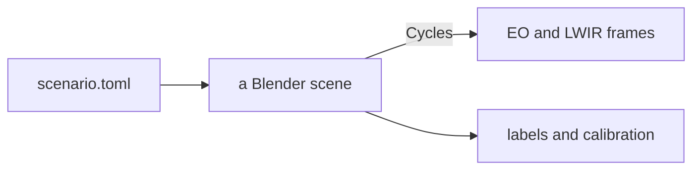

# How seascape works

seascape renders maritime scenes, in visible light (EO) and thermal (LWIR), and tells you exactly where everything in them is. This page is for engineers on the team who haven't spent much time in Blender. The first three sections are the short version: what it's for, what you get, what it can't do. The rest is how it works.

## What it's for

Real footage is expensive, and its ground truth is worse. Nobody knows the exact range to that ship, and you can't put it at 7 NM again tomorrow under the same haze. seascape lets you build the scene you want and gives you the answer key with every frame. That's useful for:

- **Training data.** Detectors for EO and LWIR, with boxes nobody had to draw. Nobody has tested yet how well a model trained on it transfers to real footage, so treat it as a supplement and evaluate on real data.
- **Testing more than detection.** Every frame carries each target's range and bearing, the camera's exact pose and a timestamp, so you can test distance estimation, tracking or motion compensation against truth, not against someone's labels.
- **Scenes that are hard to get at sea.** A target at a chosen range, the same ship from eight aspects, haze held constant, a ship sinking below the horizon. Try an idea here first, then collect the real data to evaluate it.

## What you get

For every camera and every frame: an image, plus `labels.json` (boxes in COCO format, each with its range and bearing, and where the horizon falls) and `calibration.json` (the camera's intrinsics and pose). A rig can carry several cameras with different lenses and bands, and a scenario can run as a clip with targets under way and the ownship rolling, pitching and heaving. [Outputs](../outputs.md) has the formats.

The boxes come from Blender itself. It can render a pass where each target's pixels carry the target's number instead of a colour, so a box covers only the part of a target the camera can actually see.

All the renders on this page come from [`primer.toml`](primer.toml), an open sea with small cameras, light enough for a laptop CPU. Full-size cameras want a GPU.

```bash
uv run seascape render docs/primer/primer.toml -o out/ --set 'sea.wind_speed_mps = 14'
```

## What it can't do

- Waves never hide a target, cast a shadow or throw spray. A target is never partly behind a wave.
- The sky is clear, or a still photo. No moving clouds, rain or fog banks.
- The cameras are ideal: no lens distortion, sensor noise or rolling shutter, and LWIR sees the whole 8-14 µm band evenly, unlike a real detector.
- The LWIR is good enough to look at and to regression-test against. It's not a radiometric reference, so a detection range or contrast read off a render needs a second look before anyone acts on it.

## The big picture

seascape is a Python program that uses Blender as a library. Blender ships as a Python package, `bpy`, so seascape imports it like NumPy, builds a scene from nothing, renders it and writes the files. You never need to open the Blender app, though it's nice for looking around.



The split I care most about: physics with a published source (waves, thermal emission, the thermal sky) is plain NumPy, tested without Blender. The Blender side only turns those numbers into nodes. If Blender already does something well, like the sky or the render passes, we use Blender's and write nothing.

<details>
<summary>Five minutes in the Blender app</summary>

```bash
uv run seascape build docs/primer/primer.toml -o out/primer.blend
```

Open `out/primer.blend` in [Blender](https://www.blender.org/download/), then:

1. Hover over the 3D view and press <kbd>Numpad 0</kbd> to look through the bow camera.
2. Press <kbd>Z</kbd> and pick *Rendered*. Watch the noise fade.
3. Click the *Shading* tab, then click the sea. The node graph at the bottom is the sea: every wave, the glitter and the foam live in there.
4. In the node editor's header, switch *Object* to *World*. That graph is the sky.
5. <kbd>F12</kbd> renders exactly what `seascape render` would.

Anything you change in there is gone on the next build, so put it in the code.

</details>

## From scene to picture

A Blender scene is some meshes, a material on each, a world (the sky, which lights everything) and cameras. Blender's renderer, Cycles, is a path tracer: for every pixel it shoots rays into the scene, lets them bounce the way light would, and averages what they bring back. Each ray is a sample. Few samples make a noisy average, and halving the noise takes four times as many:

<p align="center"></p>

A material is a node graph, a small program that runs wherever a ray hits and decides how light scatters off that point. Two of its ideas carry most of seascape:

- **The normal.** The mesh says *where* a surface is; the normal says *which way it faces* when light bounces off it. A shader can tilt the normal without moving the surface, and the surface then catches light as if it were tilted. Every wave in seascape is drawn this way.
- **Roughness.** A rough surface acts like millions of tiny mirrors with random tilts. Roughness sets how spread out they are: none, and the sun reflects as a dot; more, and the dot smears into a highlight.

Inside the renderer light is a float per channel, with no ceiling. Looking straight at the sun gives more than a hundred thousand times the radiance of a hull in shade, and an `exr` keeps all of it. An 8-bit `png` or `jpg` has 256 levels, so seascape puts a simple camera model after the render that picks an exposure and clips at white, roughly what a camera's processing does to its sensor data.

The sky is either Blender's Sky Texture, a physical model of sunlight scattering through clear air, or an HDRI: a 360° photo of a real sky, stored with its full brightness range so it lights the scene the way that sky did.

**Go deeper:** [Disney's Practical Guide to Path Tracing](https://www.youtube.com/watch?v=frLwRLS_ZR0), a few minutes and the best intuition there is.

## Seeing heat

<p align="center"></p>

The same scene under three skies, EO on top and LWIR below. Keep it in mind for the rest of this section and the next.

A thermal camera doesn't see light bouncing off things. It sees things glowing. Everything glows a little, and the warmer it is, the more it glows and the shorter the wavelength (Planck's law). The sun glows in the visible. The sea, at a few hundred kelvin, glows around 10 µm, right in the band an LWIR camera sees:

<p align="center">
  <picture>
    <source media="(prefers-color-scheme: dark)" srcset="charts/glow-dark.png">
    
  </picture>
</p>

The sea is the fun part, because it's also a mirror. Looking straight down, water emits about 98% of what a perfect emitter would, and less and less toward the horizon. Whatever it doesn't emit, it reflects, and what it reflects is the sky. In this band clear sky is cold overhead and close to air temperature at the horizon. So a wave tilted one way shows a colder patch of sky than one tilted the other way, and the waves show up in LWIR even when sea and air are at exactly the same temperature:

<p align="center"></p>

Each panel has its own AGC, as a thermal camera would, so their greys don't compare across panels. What changes is the contrast between sea and sky at the horizon.

Clouds are the other warm thing up there. A thick cloud is close to a perfect emitter at the temperature of the air at its base, so against the cold clear sky it shows up bright. With a photographed sky, seascape takes the clouds from the photo and gives each one the cloud base's temperature. That's the middle column of the image at the top of this section.

Blender knows nothing about any of this. It renders red, green and blue, and its reflection node can't handle water in this band. So the thermal physics is NumPy: emissivity from measured optical constants of water, and the sky from a standard atmospheric model. Blender gets the results as lookup tables and renders grey radiance. seascape turns each pixel's radiance into a brightness temperature, the temperature a perfect emitter would need to look that bright. It writes those temperatures as they are, or through AGC, which picks a span of temperatures from the scene and spreads it over 256 greys, as a thermal camera's display does.

## The sea

To an oceanographer a sea is a sum of sine waves, the way a chord is a sum of notes. The wind sets how much energy goes into each wavelength: stronger wind, longer and taller waves. Swell is long waves arriving from a storm somewhere else. seascape draws its waves from the textbook spectrum for the wind you give it, with phases from the scenario's seed, so the same seed gives the same sea.

The obvious way to make waves in Blender is the Ocean modifier, which moves a mesh up and down. Up close it looks great. Far away it shimmers, and far away is where a maritime camera spends most of its pixels. The reason is how much sea one pixel covers. The camera sees the sea almost edge-on, so a pixel lands on it as a long thin strip: narrow across the view, long along it. From 12 m up, at 1 km, one pixel of a 1920-pixel camera with a 45° view is 41 cm across but 34 m along:

<p align="center">
  <picture>
    <source media="(prefers-color-scheme: dark)" srcset="charts/footprint-dark.png">
    
  </picture>
</p>

A wave shorter than its pixel can't be drawn. Draw it anyway and it aliases into shimmer and moiré. So the sea shader works out, from the camera, how big each pixel's strip is where it lands. It draws the waves longer than that by tilting the normal, and turns all the shorter ones into roughness. The total roughness comes from measurements of real sea slope against wind (Cox & Munk, who photographed sun glitter from a plane). Near the camera you see waves; far away the same sea becomes a sheen. The glitter is where you see it best. A calm sea reflects a narrow column of sun, a windy one spreads it wide:

<p align="center"></p>

The mesh under all this is flat apart from the earth's curve, which is kilometres across and never smaller than a pixel. The price of the trick is the first item under *What it can't do*: a tilted normal can't hide anything.

On top of the waves there are whitecaps when the wind is strong enough, gusts that roughen patches as they blow past, slicks that smooth streaks along the wind, and wakes behind hulls under way.

**Go deeper:** [I Tried Simulating The Entire Ocean](https://www.youtube.com/watch?v=yPfagLeUa7k) (Acerola), a fun walk through ocean spectra.

## Far away

Two things happen to a ship as it gets farther away. The air between you and it scatters some of its light away and some sky light in, so it fades toward the colour of the sky. That's haze, and `sky.visibility_km` sets how much:

<p align="center"></p>

The right-hand column of the image at the top of *Seeing heat* is the same idea at 3 km visibility: the ship is gone in EO and still there in LWIR.

And the earth curves away under it. From 12 m up the horizon is about 13 km out, and a ship past it sinks hull-down: the sea hides its bottom first. Here's one through a long lens from a 30 m mast, where the horizon is 21 km out:

<p align="center"></p>

The same arithmetic for any camera height:

<p align="center">
  <picture>
    <source media="(prefers-color-scheme: dark)" srcset="charts/hidden-dark.png">
    
  </picture>
</p>

The air also bends light down a little. Surveyors account for that by pretending the earth is bigger than it is (`sea.refraction_k`), and seascape does the same.

## Where next

- [Scenarios](../scenarios.md): writing one, `--set`, skies, clips.
- [Outputs](../outputs.md): label and calibration formats, LWIR files, loading into FiftyOne.
- [Assets](../assets.md): the ships, buoys and debris you can place.
- [Contributing](../../CONTRIBUTING.md) and [AGENTS.md](../../AGENTS.md): the checks, the conventions, and the Blender traps that fail silently.

[`figures.py`](figures.py) redraws the renders on this page and [`charts.py`](charts.py) the charts.

## Words

| | |
|---|---|
| AGC | A thermal camera's automatic choice of which temperatures map to black and white |
| Aliasing | Detail finer than a pixel showing up as false patterns |
| Brightness temperature | The temperature a perfect emitter would need to look as bright as a pixel |
| Emissivity | How much a surface glows compared with a perfect emitter, 0 to 1 |
| EO | Electro-optical: an ordinary visible-light camera |
| HDRI | A 360° sky photo that keeps the full brightness range |
| LWIR | Long-wave infrared, 8-14 µm: what thermal cameras see |
| Normal | The direction a surface faces, as far as light is concerned |
| Sample | One ray per pixel; a pixel averages many |
