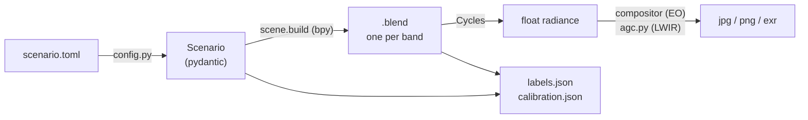
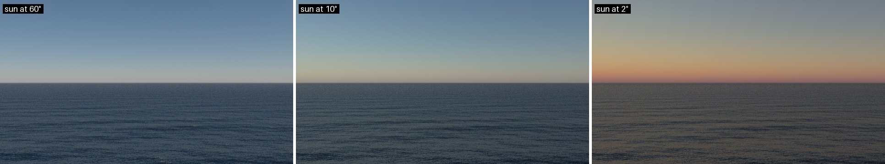

# Primer

Blender, light, heat and the sea, for people who read seascape's output or code without having driven Blender. Each section opens with a question, answers it, mostly with a render, and ends with somewhere to go deeper. The figures are real renders of [`primer.toml`](primer.toml), each row one setting apart, so every panel is also a command you can run.

```bash
uv run seascape render docs/primer/primer.toml -o out/ --set 'sea.wind_speed_mps = 14'
```

`primer.toml` is the open sea at 640×360, quick even on a laptop CPU. [`figures.py`](figures.py) redraws every figure.

**Contents:** [the pipeline](#the-pipeline) · [rendering](#rendering-a-picture-is-an-average) · [shaders](#shaders-tiny-programs-at-every-point) · [HDR and skies](#light-as-numbers) · [EO and LWIR](#eo-and-lwir-two-different-worlds) · [the sea](#the-sea) · [haze](#haze) · [the horizon](#the-horizon-is-closer-than-you-think) · [ground truth](#ground-truth-for-free) · [limitations](#limitations) · [glossary](#glossary)

## The pipeline

> Is seascape a Blender plugin?

No. Blender ships as a Python wheel, `bpy`, and seascape imports it like NumPy: it builds a scene from nothing in its own process, renders it and writes files. The Blender application only looks.



Physics with a published source (waves, emissivity, the thermal sky) is plain NumPy in `waves.py`, `lwir.py` and `wakes.py`, tested without Blender. `scene.py` and `sea.py` turn those numbers into Blender nodes.

<details>
<summary><b>Try it:</b> a five-minute tour of the scene in Blender</summary>

```bash
uv run seascape build docs/primer/primer.toml -o out/primer.blend
```

Open `out/primer.blend` in [Blender](https://www.blender.org/download/), then:

1. Hover over the 3D view and press <kbd>Numpad 0</kbd>: you are looking through the bow camera.
2. Press <kbd>Z</kbd> → *Rendered*. Cycles starts refining the picture; watch the noise fade (next section).
3. Click the *Shading* tab at the top, then click the sea in the viewport. The bottom half is the `sea` material's node graph: every wave, the glitter and the whitecaps are in there.
4. In the node editor's header, switch *Object* to *World*: that graph is the sky.
5. <kbd>F12</kbd> renders exactly what `seascape render` would.

Nothing you change there survives the next `seascape build`. Put it in the code.

Never opened Blender? Blender Guru's [donut tutorial](https://www.youtube.com/watch?v=z-Xl9tGqH14) is how most people start.

</details>

## Rendering: a picture is an average

> Why does a fresh render look like TV static?

A **scene** is meshes (geometry), **materials** (how each surface treats light), a **world** (the sky, which lights everything and is what a ray sees when it escapes) and **cameras**.

**Cycles**, Blender's path tracer, works like counting votes. For each pixel it fires a ray into the scene, lets it bounce off surfaces, at random by how each one scatters, until it reaches the sky, and records what light it brought back. One such path is a **sample**. A pixel's value is the mean over its samples, and a mean of few votes is noisy: halving the noise takes four times the samples.


**EEVEE**, Blender's other engine, rasterizes like a game engine: fast, but it caps and darkens reflections at grazing angles, which is most of a sea. seascape renders with Cycles only.

Two Cycles defaults are off on purpose:

- **Denoising.** Intel's OIDN is a clever image filter, trained to guess what the noise hides. Guessing is not physics: it smooths waves away and moves LWIR temperatures by kelvins.
- **The far clip.** A camera draws nothing past `clip_end`, 1 km by default, and the cut-off looks just like a horizon. seascape puts it past the sea's edge.

**Go deeper:** [Disney's Practical Guide to Path Tracing](https://www.youtube.com/watch?v=frLwRLS_ZR0) (Walt Disney Animation Studios, a few minutes, the best intuition there is) · [Coding Adventure: Ray Tracing](https://www.youtube.com/watch?v=Qz0KTGYJtUk) (Sebastian Lague, builds one from scratch, noise and all)

## Shaders: tiny programs at every point

> How does a flat sheet look like a rough sea?

A material is a **node graph** that runs at every point a ray hits. Inputs (position, surface normal, view direction, textures) flow through math nodes into a **BSDF**, which says where incoming light scatters, or an **Emission**, which is light the surface gives off.

Three ideas carry most of seascape:

- **The normal is a lie the shader may tell.** The mesh decides *where* a surface is; the normal decides *which way it faces* when light bounces. A shader can tilt the normal without moving anything. That is bump mapping, and it is every wave in seascape ([why](#why-waves-are-normals)).
- **Roughness is detail too small to draw.** A rough BSDF (GGX here) treats the surface as millions of tiny mirrors with random tilts. Roughness sets how wide the tilts spread: 0 is a mirror and the sun reflects as a dot; more, and the dot smears into a highlight.
- **Lookup tables.** Some physics has no Blender node: band-averaged emissivity, the LWIR sky against elevation. NumPy evaluates it once, `blend.curve_image` bakes it into a 1D float image, and the shader reads it like a texture.

**Go deeper:** [The Book of Shaders](https://thebookofshaders.com/) (edit shaders live in the browser) · [LearnOpenGL: Normal Mapping](https://learnopengl.com/Advanced-Lighting/Normal-Mapping) · [LearnOpenGL: PBR Theory](https://learnopengl.com/PBR/Theory) (microfacets, roughness and Fresnel on one page)

## Light as numbers

### HDR

> Why can't a jpg hold the sun?

A renderer counts light as linear **radiance**: unbounded floats proportional to power. Looking into the sun and into the shade under a hull differ by a factor of more than a hundred thousand. An 8-bit `png` or `jpg` has 256 levels.

- **HDR** (high dynamic range) keeps the floats. `exr` is the file format for it, and what you want when a pixel value is measured.
- **8-bit** needs a scale (exposure), a clip at white and a display curve. That chain is the **view transform**. Blender's default, AgX, is a film look; seascape uses `Standard`, which clips as a sensor does.

An 8-bit EO render passes through a camera seascape builds in Blender's **compositor** (the post-processing node graph): lens glare, a slight blur and auto-exposure on the frame's mean log luminance. That auto-exposure is why the three skies below look about equally bright, though the high sun's sky sends many times the light of the low one's. An `exr` skips the camera and holds the radiance as rendered.

### Skies

> Where does the light come from?



- **Sky Texture**, the default: Blender's physically based clear sky, light scattered by air and aerosols, right down to twilight. Low sun means a long path through air, which strips the blue and leaves the red. `sky.sun_elevation_deg`, `sky.sun_bearing_deg` and `sky.aerosol_density` drive it.
- **HDRI** (`sky.hdri`): a 360° photograph of a real sky, stored in HDR as an **equirectangular** image, a world map of the sky with longitude across and latitude up. Its sun is unclipped, so the photo lights the scene as that sky did and shows in every reflection. seascape turns it so its sun lands on `sky.sun_bearing_deg`. The README's hero is `belfast_sunset`; `seascape assets list` shows the rest.

```bash
uv run seascape render docs/primer/primer.toml -o out/ --set 'sky.hdri = "belfast_sunset"'
```

**Go deeper:** [LearnOpenGL: HDR](https://learnopengl.com/Advanced-Lighting/HDR) (exposure and tone mapping with pictures) · [Filmic Blender](https://sobotka.github.io/filmic-blender/) (Troy Sobotka on scene light versus display, the idea behind Blender's view transforms)

## EO and LWIR: two different worlds

> Why does the sky look black to a thermal camera?

<p align="center"></p>

| | EO | LWIR |
|---|---|---|
| Wavelength | 0.4-0.7 µm, visible | 8-14 µm, thermal |
| The light comes from | The sun, direct and scattered by the sky | Everything, by its own temperature |
| A pixel says | How much sunlight came back, in colour | How warm the scene looks: a brightness temperature |
| The sky | Bright, blue | Cold overhead, near air temperature at the horizon |
| The sea | Reflects the sky, glitters in the sun, dark beneath | Emits by its temperature, reflects the cold sky by what it does not emit |
| A hull | Its paint, lit by the sun | Painted steel, warmer where sunlit (`sky.solar_gain_k`) |
| Files | RGB `jpg`/`png` through the camera, or `exr` | 16-bit centikelvin `png`, or 8-bit grey `jpg` after AGC |

### Everything glows

You glow too. Anything at a few hundred kelvin radiates, mostly in 8-14 µm. **Planck's law** gives how much a perfect emitter, a **blackbody**, sends at each wavelength and temperature. A real surface sends a fraction of that, its **emissivity** ε. Seawater is opaque in this band, so whatever it does not emit, it reflects (**Kirchhoff's law**, ε = 1 − R):

$$L_\text{sea} = \varepsilon(\theta)\,B(T_\text{sea}) + \big(1-\varepsilon(\theta)\big)\,L_\text{sky}$$

ε depends on the angle θ between the view and the vertical. From `lwir.py`, for flat water at 288 K:

| Looking | θ | ε | The sea is |
|---|---|---|---|
| Straight down | 0° | 0.985 | almost a blackbody: you see its temperature |
| Down at 30° | 60° | 0.946 | still mostly itself |
| Toward the horizon, 700 m out from 12 m up | 89° | 0.105 | 90% mirror |

And the mirror shows a cold sky. The North Sea profile seascape uses by default puts the zenith at about 225 K (−48 °C) and the sky 5° up at about 271 K, with the air at 288 K. Clear air hardly emits, so looking up you see the cold upper atmosphere and space beyond.

<details>
<summary><b>Puzzle:</b> sea and air at exactly the same temperature. Can a thermal camera see the waves?</summary>

Yes. Each wave facet tilts toward a different height of the sky, and the sky runs from cold overhead to air temperature at the horizon. A facet tilted toward the camera reflects a higher, colder patch of sky, and one tilted away a lower, warmer one, so each reads a different temperature. The middle panel below is that case.

</details>


Each panel has its own AGC, so their greys do not compare: what changes is the contrast between sea and sky at the horizon.

Why NumPy? Blender has no 8-14 µm band, and its Fresnel node takes a real index of refraction, where water's is complex (n + ik: it absorbs). `lwir.py` computes emissivity from measured optical constants (Nalli et al. 2022), averages it over the wave slopes and hands the shader a lookup table. Blender renders grey radiance, R = G = B, and `render.py` turns it back into a temperature per pixel.

**AGC.** A thermal camera stretches a span of a few kelvin across its 256 grey levels, and **automatic gain control** picks that span from each frame. `agc.py` does the same, damped over time so a clip does not flicker. The 16-bit `png` keeps the temperatures: `cv2.imread(path, cv2.IMREAD_UNCHANGED) / 100` is kelvin.

**Go deeper:** [Thermal imaging guidebook](http://www.flirmedia.com/MMC/THG/Brochures/T820264/T820264_EN.pdf) (FLIR, PDF; emissivity and reflected temperature, for people who point real cameras) · [Radiative sky cooling](https://www.osti.gov/servlets/purl/1424949) (Sun et al. 2017, PDF; why the 8-14 µm sky is cold)

## The sea

### Waves are a chord

> What is a sea, to a physicist?

A sum of sine waves, like a chord is a sum of notes. Oceanographers describe a sea by its **spectrum**: how much energy sits at each frequency, the way an equaliser shows music.

- **Wind sea.** The Pierson-Moskowitz spectrum gives a fully developed sea for a wind speed; the stronger the wind, the longer its peak wave. Directions spread around downwind.
- **Swell.** Long waves from a distant storm, one period, arriving in neat lines.
- **Dispersion.** In deep water ω² = gk: a wave's length fixes its speed, and long waves outrun short ones. That is how swell reaches you before the storm does.

| Wind at 10 m | Peak wavelength (`waves.peak_omega_rad_s`) | Peak period |
|---|---|---|
| 2 m/s | 3.6 m | 1.5 s |
| 7 m/s | 46 m | 5.4 s |
| 14 m/s | 185 m | 11 s |

Each wave is `a cos(k·x − ωt + φ)`, its phase drawn from the scenario's seed: same seed, same sea.

### Why waves are normals

> Why not just model the waves as geometry?

Because of how much sea one pixel sees. Take a 1920-pixel camera with a 45° field of view, 12 m above the water:

| Range | Pixel footprint across | Grazing angle | Pixel footprint along the view |
|---|---|---|---|
| 50 m | 2 cm | 13.8° | 9 cm |
| 200 m | 8 cm | 3.4° | 1.4 m |
| 1 km | 41 cm | 0.7° | 34 m |
| 5 km | 2 m | 0.1° | about 1 km |

At 1 km one pixel spans a 7 m/s sea's whole peak wavelength. Geometry smaller than a pixel does not average out; it **aliases**, into shimmer, moiré and crawling lines, the way a striped shirt strobes on TV. Blender's Ocean modifier displaces a mesh, so it breaks exactly where a maritime camera looks.

So every pixel draws the waves longer than its own footprint, as a tilt of the shading normal, and folds the slope of all the shorter ones into the BSDF's roughness (Bruneton, Neyret & Holzschuch 2010). How rough in total comes from **Cox & Munk** (1954), who flew over Hawaii photographing sun glitter and found the sea's slope variance grows in a straight line with wind speed. Near the camera you see waves; far off the same sea becomes a sheen; in between they blend.


The glitter is the best place to watch it: a calm sea reflects a narrow column of sun, a windy one spreads it wide and breaks it into sparkles. The column's width *is* Cox & Munk's measurement, run backwards.

The sea's mesh exists only for the earth's curve, kilometres across and never sub-pixel. The cost of all this: a normal cannot hide anything, so a wave never occludes a target.

### Glitter, whitecaps, slicks, gusts, wakes

| Effect | What it is | In a scenario | Source |
|---|---|---|---|
| Glitter | The sun's reflection broken into points that twinkle | sun low and ahead | Longuet-Higgins 1960 |
| Whitecaps | Foam where waves accelerate down faster than a threshold; cover grows as U^3.41 | `sea.wind_speed_mps` | Monahan 1980, Snyder & Kennedy 1983 |
| Gusts | Patches of stronger wind, cat's paws, drifting downwind | always, from the wind | Kaimal, von Kármán |
| Slicks | Natural films gathered into streaks along the wind, damping the short waves | `sea.slick_cover` | Cox & Munk, Leibovich 1983 |
| Wakes | A hull's Kelvin wedge, half-angle arcsin ⅓ ≈ 19.5°, its brightest arms narrowing at speed; a turbulent band and stern foam | a target with `speed_mps` | Kelvin, Rabaud & Moisy 2013 |

```bash
uv run seascape render docs/primer/primer.toml -o out/ --set 'sea.wind_speed_mps = 5' --set 'sea.slick_cover = 0.3'
```

Every physical number in the code cites its source in a comment beside it; the module docstrings of `waves.py`, `sea.py` and `wakes.py` list them all.

**Go deeper:** [I Tried Simulating The Entire Ocean](https://www.youtube.com/watch?v=yPfagLeUa7k) (Acerola, video; spectra and dispersion, game-dev style) · [Simulating Ocean Water](https://jtessen.people.clemson.edu/reports/papers_files/coursenotes2004.pdf) (Tessendorf, the classic course notes behind most film oceans) · [Glittering Light on Water](https://psl.noaa.gov/outreach/education/science/glitter/) (NOAA, ends on Cox & Munk) · [Seamless transitions from geometry to BRDF](https://inria.hal.science/inria-00443630) (Bruneton et al. 2010, the paper seascape's sea follows) · [Sampling and Reconstruction](https://pbr-book.org/3ed-2018/Sampling_and_Reconstruction) (PBR book, free; aliasing properly) · [Kelvin wake](https://en.wikipedia.org/wiki/Kelvin_wake) (Wikipedia)

## Haze

> Why do far ships fade to the colour of the sky?

Air between the camera and a ship takes away part of the ship's light and adds sky light scattered into the line of sight. **Koschmieder** wrote it down in 1924:

$$L_\text{seen} = e^{-\tau} L_\text{ship} + (1 - e^{-\tau})\,L_\text{sky}$$

The optical depth τ grows with distance. At the **meteorological visibility**, `sky.visibility_km`, a black target keeps 2% of its contrast against the sky. In LWIR water vapour does most of the absorbing, and τ comes from LOWTRAN 7's band models for `sky.atmosphere`. `scene._haze` slips the mix into every material the build makes.


**Go deeper:** [Visibility](https://en.wikipedia.org/wiki/Visibility) (Wikipedia, Koschmieder's relation) · [Aerial perspective](https://en.wikipedia.org/wiki/Aerial_perspective) (Wikipedia; painters knew first)

## The horizon is closer than you think

> How far can a camera 12 m up see the sea?

About 13 km. The earth curves away, and the horizon from height h is where a ray grazes it:

$$d = \sqrt{2\,h\,R/(1-k)}$$

R is the earth's radius. The air bends rays slightly downward, which surveyors model as a bigger earth, R / (1 − k), with k ≈ 0.13 for average air (`sea.refraction_k`). Beyond the horizon a ship sinks **hull-down**: the sea hides its bottom first.

From a mast top 30 m up the horizon is 21 km out. Through a 1.5° telephoto, in clear air:


At 15 km the ship sits on a mirror: at that grazing angle the sea reflects almost everything. At 45 km the curve hides about 39 m, the whole hull, and only the bridge and the mast tip are left.

Every frame's labels say where the horizon falls in the image: `horizon_px`, a polyline, since a wide field of view sees the horizon slightly bowed.

**Go deeper:** [Dip of the Horizon](https://aty.sdsu.edu/explain/atmos_refr/dip.html) (Andrew T. Young, with and without refraction) · [Horizon](https://en.wikipedia.org/wiki/Horizon) (Wikipedia, the distance formulas)

## Ground truth for free

> Who labels the boxes?

Nobody: seascape placed everything, so the truth is computed.

- **Boxes** come from Blender's object-index pass, a render layer in which each target's pixels carry its own integer instead of a colour. Only the pixels you can see count, so a target half behind another gets the box of its visible half.
- **Range and bearing** come from the geometry, measured on the camera as built rather than as the scenario asked for.
- **Calibration** is a pinhole camera with no distortion, intrinsics and extrinsics in OpenCV's conventions.
- **Time.** Every frame is stamped with `time_s`. Sensors run at different rates, so a frame number is not an instant.

[Outputs](../outputs.md) has the formats, and how to load them into FiftyOne.

## Limitations

| Limitation | So |
|---|---|
| Waves are normals | A wave never hides a target or casts a shadow; the horizon line is smooth; no spray |
| Hulls follow the sea at once | Pitch and roll are the plane fitted to the waves under the hull, with no inertia |
| Skies are clear or a still photo | No moving clouds, rain or fog banks; haze is uniform |
| Ideal sensor | Pinhole, no lens distortion, no sensor noise, no rolling shutter. EO gets glare, blur and auto-exposure; LWIR gets AGC |
| LWIR approximations | Fixed model atmospheres; band emissivity assumes a flat sensor response; haze on reflected rays is approximate |
| Not a radiometric reference | Good to look at and to regression-test against. A detection range or contrast read off a render needs review before anyone acts on it |
| Speed | Cycles wants a GPU; a CPU works, slowly |

## Glossary

| Term | Meaning |
|---|---|
| AGC | Automatic gain control: a thermal camera's per-frame choice of which temperatures map to black and white |
| Aliasing | Detail finer than a pixel showing up as false patterns |
| BSDF | A function describing where a surface scatters light |
| Blackbody | A perfect emitter; Planck's law gives its radiance |
| Brightness temperature | The temperature a blackbody would need to send the measured radiance |
| Compositor | Blender's post-processing node graph, applied to the rendered image |
| Emissivity (ε) | The fraction of a blackbody's radiance a surface emits, 0 to 1 |
| EO | Electro-optical: a visible-light camera |
| Equirectangular | A 360° image laid out as longitude by latitude |
| EXR | OpenEXR, a float image format for HDR |
| Footprint | The patch of sea one pixel covers |
| Fresnel | How reflection grows toward grazing angles |
| GGX | The microfacet distribution behind Blender's rough BSDFs |
| HDR / HDRI | High dynamic range; an HDRI is an HDR panorama used as a sky |
| IOR | Index of refraction |
| LWIR | Long-wave infrared, 8-14 µm |
| Node graph | Blender's visual programs for shaders and the compositor |
| Path tracing | Rendering by following random light paths per pixel and averaging |
| Sample | One such path; more samples, less noise |
| Swell | Long waves from distant weather |
