# How seascape works

seascape makes fake sea. You describe a scene in a TOML file (where the camera sits, the weather, which ships at what range) and it renders what an EO and a thermal camera would see, along with the answer key for every frame.

<p align="center">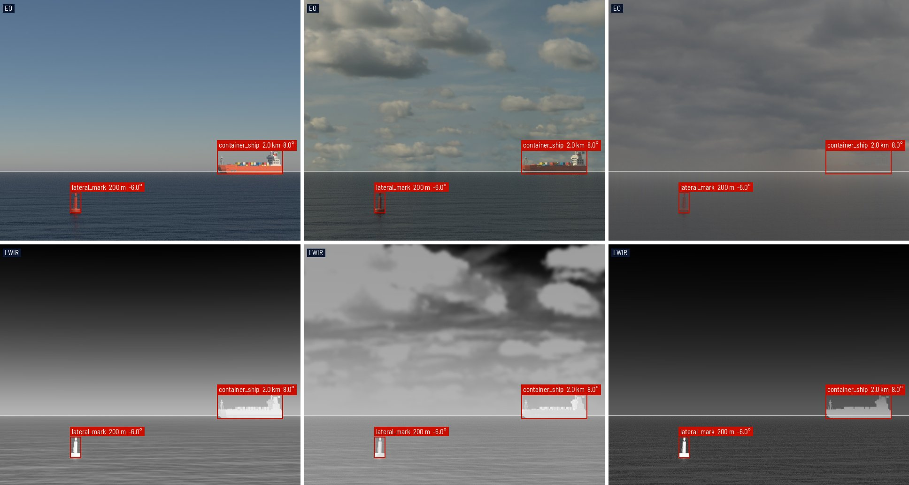</p>

## Why bother

Real footage is great right up until you need the truth. Nobody knows the exact range to that ship, and you can't ask it to come back tomorrow at the same distance in the same haze. Here you can.

That's handy for training detectors on boxes nobody had to draw, though nobody has checked yet how well that carries over to real footage, so evaluate on the real thing. It's maybe more handy for testing everything after detection (distance estimation, tracking, motion compensation) against numbers that are actually right. And for trying an idea on a scene you'd never get at sea, before going out to collect the data.

Every frame comes with `labels.json` (a COCO box per target, with its range and bearing, plus where the horizon falls) and `calibration.json` (the camera's intrinsics and pose). The boxes come straight from Blender, which can render each target's pixels as its own number, so a box only covers what the camera actually sees. [Outputs](../outputs.md) has the details.

## The catch

It's a model, and some corners are cut on purpose. The big one: waves are drawn by tilting the surface's shading, not by moving it, so a wave can never hide a target or cast a shadow (the sea section says why it's worth it). The cameras are perfect, with no noise, distortion or rolling shutter. The sky is clear or a still photo. And the LWIR is fine for looking at and for regression tests, but it isn't a radiometric reference: if you read a detection range off a render, get someone to check it before acting on it.

## Making a picture

seascape is a Python program that uses Blender as a library. Blender ships as a package, `bpy`, so seascape imports it like NumPy, builds the scene from nothing and renders it. Physics with a published source (waves, thermal emission, the thermal sky) is plain NumPy, tested without Blender, and the Blender side only turns those numbers into nodes.

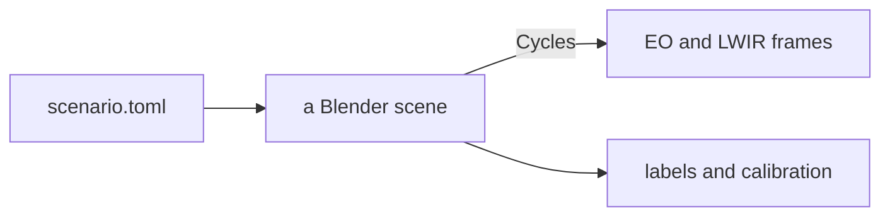

Blender's renderer, Cycles, is a path tracer. For every pixel it fires rays into the scene, lets them bounce around like light would, and averages what comes back. Each ray is a sample, and a few samples make a noisy average:

<p align="center">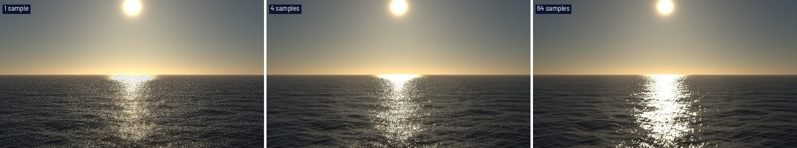</p>

Two ideas from shaders, the little programs that decide how a surface looks, do most of the work here. The *normal* is which way a surface faces as far as light is concerned, and a shader can tilt it without moving the surface. *Roughness* is detail too small to draw, treated as millions of tiny mirrors pointing slightly different ways.

Every render on this page comes from [`primer.toml`](primer.toml), small enough for a laptop CPU, so you can poke at any of them:

```bash
uv run seascape render docs/primer/primer.toml -o out/ --set 'sea.wind_speed_mps = 14'
```

<details>
<summary>Five minutes in the Blender app</summary>

```bash
uv run seascape build docs/primer/primer.toml -o out/primer.blend
```

Open it in [Blender](https://www.blender.org/download/), hover over the 3D view and press <kbd>Numpad 0</kbd> to look through the camera, then <kbd>Z</kbd> → *Rendered*. The *Shading* tab shows the sea's node graph when you click the sea; switch *Object* to *World* in the node editor's header for the sky. Anything you change there is gone on the next build, so put it in the code.

</details>

## The sea

The obvious way to make waves in Blender is the Ocean modifier, which moves a mesh up and down. Up close it looks great. Far away it shimmers, and far away is where a maritime camera spends most of its pixels. The camera sees the sea almost edge-on, so each pixel lands on it as a long thin strip:

<p align="center">
  <picture>
    <source media="(prefers-color-scheme: dark)" srcset="charts/footprint-dark.png">
    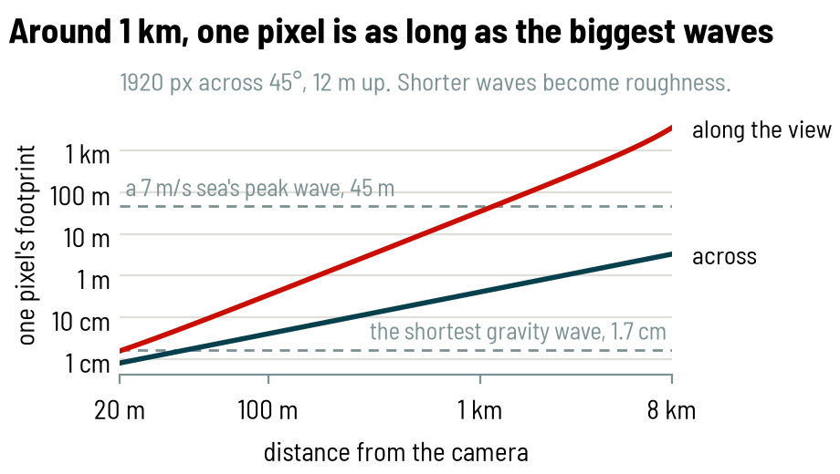
  </picture>
</p>

A wave shorter than its pixel can't be drawn, only aliased. So the sea works out each pixel's strip from the camera, draws the waves longer than it by tilting the normal, and turns the rest into roughness. How rough in total comes from Cox & Munk, who photographed sun glitter from a plane in the fifties. The glitter is where you see it:

<p align="center">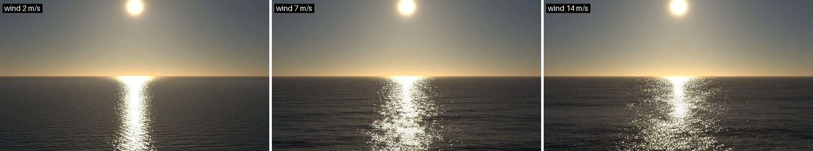</p>

## Seeing heat

A thermal camera doesn't see light bouncing off things. It sees things glowing. Everything glows, and warmer things glow more and at shorter wavelengths, so the sun lands in the visible and the sea in the band an LWIR camera sees:

<p align="center">
  <picture>
    <source media="(prefers-color-scheme: dark)" srcset="charts/glow-dark.png">
    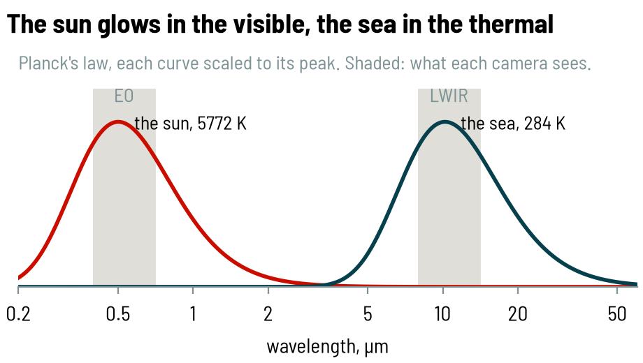
  </picture>
</p>

Same scene, both cameras:

<p align="center">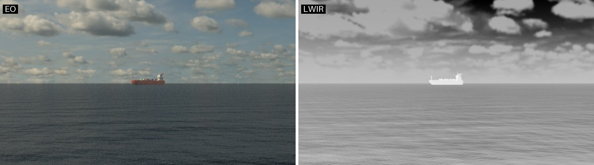</p>

The ship is warm. The clouds are warm too: a thick cloud glows at the temperature of the air at its base, while the clear sky between them is cold. And the sea is a mirror. Water mostly glows like itself when you look straight down, and mostly reflects the sky as you look toward the horizon. That's why the waves show up even when sea and air are at exactly the same temperature (middle panel; each panel sets its own grey scale, like a thermal camera does):

<p align="center">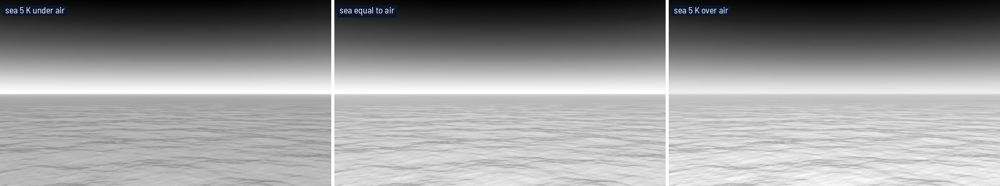</p>

Blender only knows red, green and blue, so all of this is NumPy: emissivity from measured optical constants of water, the sky from a standard atmospheric model. Blender just gets lookup tables.

## Far away

Two things happen as a ship gets farther away. The air scatters its light away and sky light in, so it fades into the sky:

<p align="center">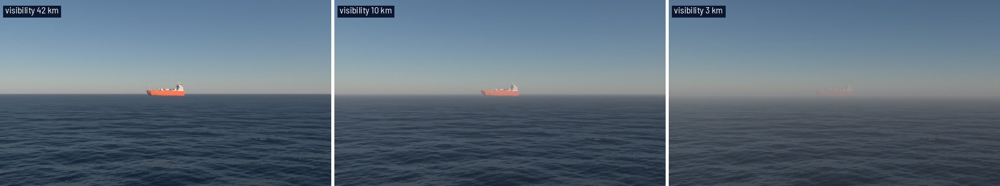</p>

And the earth curves away under it. From a 30 m mast the horizon is 21 km out, and past it a ship sinks hull-down:

<p align="center">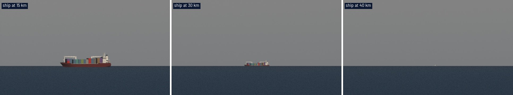</p>

<p align="center">
  <picture>
    <source media="(prefers-color-scheme: dark)" srcset="charts/hidden-dark.png">
    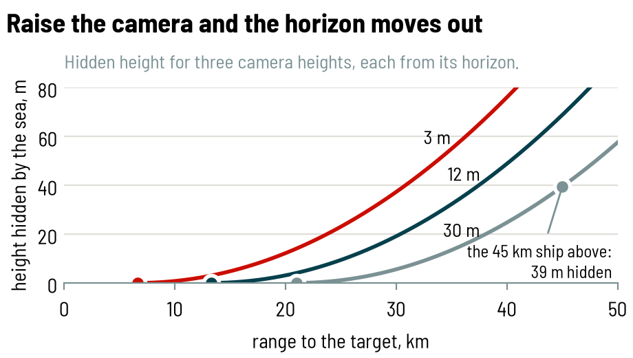
  </picture>
</p>

That's it. From here: [Scenarios](../scenarios.md) to write your own, [Assets](../assets.md) for what you can put on the water, and [Contributing](../../CONTRIBUTING.md) plus [AGENTS.md](../../AGENTS.md) before you change anything. [`figures.py`](figures.py) and [`charts.py`](charts.py) redraw everything on this page.
