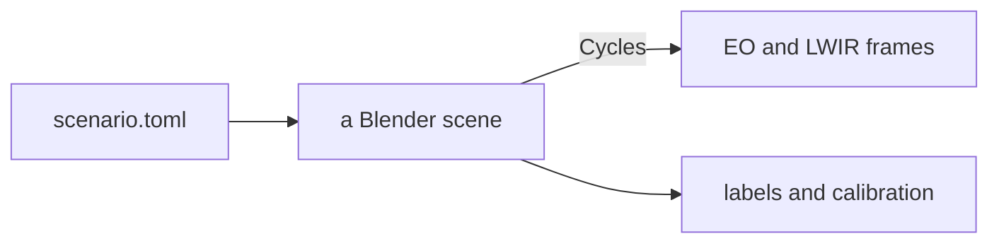
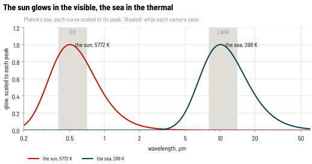
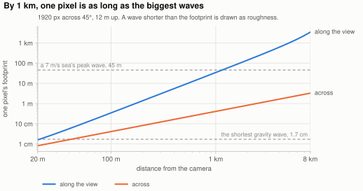
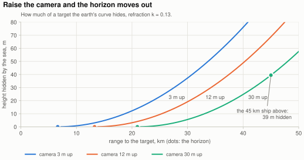

# How seascape works

This is a tour of how seascape makes its pictures, for anyone on the team who uses what it renders, or wants to change it, without having spent much time in Blender. I'll go through the main pieces in roughly the order a frame passes through them. It skips most of the details on purpose. The code has those, and every physical number in it cites its source in a comment.

All the pictures here are real renders of [`primer.toml`](primer.toml), a small open-sea scenario that renders in seconds on a laptop. So you can rerun any of them and poke at it:

```bash
uv run seascape render docs/primer/primer.toml -o out/ --set 'sea.wind_speed_mps = 14'
```

[`figures.py`](figures.py) redraws the renders and [`charts.py`](charts.py) the charts.

## The big picture

seascape is a Python program that happens to use Blender as a library. Blender ships as a Python wheel, `bpy`, so seascape imports it like it imports NumPy, builds a scene from nothing, renders it and writes the files. You never need to open the Blender app, though it's nice for looking around.



The split I care most about: physics that has a published source (waves, thermal emission, the thermal sky) is plain NumPy, tested without Blender. The Blender side only turns those numbers into nodes. If Blender already does something well, like the sky or the render passes, we use Blender's and write nothing.

<details>
<summary>Five minutes in the Blender app</summary>

```bash
uv run seascape build docs/primer/primer.toml -o out/primer.blend
```

Open `out/primer.blend` in [Blender](https://www.blender.org/download/), then:

1. Hover over the 3D view and press <kbd>Numpad 0</kbd> to look through the bow camera.
2. Press <kbd>Z</kbd> and pick *Rendered*. Watch the noise fade (next section).
3. Click the *Shading* tab, then click the sea. The node graph at the bottom is the sea: every wave, the glitter and the foam live in there.
4. In the node editor's header, switch *Object* to *World*. That graph is the sky.
5. <kbd>F12</kbd> renders exactly what `seascape render` would.

Anything you change in there is gone on the next build, so put it in the code. If you've never touched Blender, Blender Guru's [donut tutorial](https://www.youtube.com/watch?v=z-Xl9tGqH14) is where everyone starts.

</details>

## Rendering is averaging

A scene is some meshes, a material on each (how its surface treats light), a world (the sky, which lights everything) and cameras.

Blender's renderer, Cycles, is a path tracer. For every pixel it shoots a ray into the scene, lets it bounce around at random the way light would, and records what it brings back. One such path is a sample, and a pixel is the average of its samples. A few samples give a noisy average, and halving the noise takes four times as many:

<p align="center"></p>

Blender has a second, faster engine, EEVEE, which works like a game engine. It cheats on reflections at grazing angles, and a sea seen from a ship is almost all grazing angles, so seascape only uses Cycles. I also turn off Cycles' denoiser. It's a neural network that guesses what the noise is hiding, and a guess is not a measurement.

**Go deeper:** [Disney's Practical Guide to Path Tracing](https://www.youtube.com/watch?v=frLwRLS_ZR0) (a few minutes, the best intuition there is) · [Coding Adventure: Ray Tracing](https://www.youtube.com/watch?v=Qz0KTGYJtUk) (Sebastian Lague builds one from scratch)

## Shaders

A material in Blender is a node graph, a little program that runs at every point a ray hits. It takes in things like the position, the direction the surface faces and the direction the ray came from, and it decides how light scatters off that point, or how much light the point gives off itself.

Two ideas from shaders carry most of seascape:

- **The normal can lie.** The mesh says *where* a surface is. The normal says *which way it faces* when light bounces off it. A shader is free to tilt the normal without moving the surface, and the surface will catch light as if it were tilted. Every wave in seascape works this way (more below).
- **Roughness is detail too small to draw.** A rough surface is treated as millions of tiny mirrors with random tilts. Roughness says how spread out those tilts are: zero and the sun reflects as a dot, more and the dot smears into a highlight.

**Go deeper:** [The Book of Shaders](https://thebookofshaders.com/) (you edit them live in the browser) · [LearnOpenGL: PBR Theory](https://learnopengl.com/PBR/Theory) (roughness and Fresnel on one page)

## Light, HDR and skies

Inside the renderer light is just numbers, and they get big. The sun is more than a hundred thousand times brighter than the shade under a hull. That's high dynamic range (HDR), and float formats like `exr` keep all of it. A `png` or `jpg` has 256 levels, so getting there means picking an exposure and clipping whatever is brighter, which is what a camera does too. For 8-bit EO frames seascape adds a small camera after the render: a bit of lens glare and blur, then auto-exposure. That auto-exposure is why these three skies look about as bright as each other, although the high sun sends far more light:

<p align="center"></p>

The default sky is Blender's Sky Texture, a physical model of sunlight scattering through clear air. A low sun goes through a lot more air, which scatters the blue away and leaves the red. The other option is an HDRI: a 360° photo of a real sky, stored in HDR so the sun keeps its real brightness. It lights the scene the way that sky did and shows up in every reflection. seascape turns the photo so its sun lands where the scenario wants it.

```bash
uv run seascape render docs/primer/primer.toml -o out/ --set 'sky.hdri = "belfast_sunset"'
```

**Go deeper:** [LearnOpenGL: HDR](https://learnopengl.com/Advanced-Lighting/HDR) · [Filmic Blender](https://sobotka.github.io/filmic-blender/) (Troy Sobotka on scene light versus what a screen can show)

## Seeing heat

<p align="center"></p>

The same scene under three skies, EO on top and LWIR below. Keep it in mind for the rest of this section and the next.

A thermal camera doesn't see light bouncing off things. It sees things glowing. Everything glows a little, and the warmer it is the more it glows and the shorter the wavelength (Planck's law). The sun is hot enough to glow in the visible. The sea, at a few hundred kelvin, glows around 10 µm, right in the band a long-wave infrared (LWIR) camera sees:

<p align="center">
  <picture>
    <source media="(prefers-color-scheme: dark)" srcset="charts/glow-dark.svg">
    
  </picture>
</p>

The sea is the fun part, because it's also a mirror. Water emits about 98% of what a perfect glower would when you look straight down, and less and less toward the horizon. Whatever it doesn't emit, it reflects. What it reflects is the sky, and in this band clear sky is cold overhead and close to air temperature at the horizon. So a wave facet tilted one way shows a colder patch of sky than one tilted the other way, and the waves show up in LWIR even when sea and air are at exactly the same temperature:

<p align="center"></p>

Clouds are the other warm thing up there. A thick cloud is close to a blackbody, at the temperature of the air at its base, so against the cold clear sky it shows up bright. With a photographed sky, seascape finds the clouds in the photo by colour (clear sky is bluer than cloud) and gives each one the cloud base's temperature. That's the middle column of the image at the top of this section.

Blender knows nothing about any of this. It renders red, green and blue, and its reflection node can't handle water in this band. So the thermal physics is NumPy: emissivity from measured optical constants of water, and the sky from LOWTRAN 7, a standard atmospheric model. Blender gets the results as lookup tables. It renders grey radiance, and seascape turns that back into a temperature per pixel. The `png` it writes keeps kelvins (divide by 100). The `jpg` goes through AGC, which is how a thermal camera squeezes a few kelvin of contrast into 256 greys.

**Go deeper:** [FLIR's thermal imaging guidebook](http://www.flirmedia.com/MMC/THG/Brochures/T820264/T820264_EN.pdf) (emissivity and reflections, for people who point real cameras) · [Radiative sky cooling](https://www.osti.gov/servlets/purl/1424949) (why the 8-14 µm sky is cold)

## The sea

To an oceanographer a sea is a sum of sine waves, the way a chord is a sum of notes. The wind sets how much energy goes into each wavelength: stronger wind, longer and taller waves. Swell is long waves that arrive from a storm somewhere else. Long waves travel faster than short ones, which is how swell gets to you before the storm does. seascape draws its waves from the textbook spectrum for the wind you give it, with phases from the scenario's seed, so the same seed gives the same sea.

The obvious way to make waves in Blender is the Ocean modifier, which moves the vertices of a mesh up and down. Up close it looks great. Far away it shimmers, and far away is where a maritime camera spends most of its pixels. The problem is how much sea one pixel covers:

<p align="center">
  <picture>
    <source media="(prefers-color-scheme: dark)" srcset="charts/footprint-dark.svg">
    
  </picture>
</p>

A wave shorter than a pixel can't be drawn. Draw it anyway and it aliases into shimmer and moiré. So I followed Bruneton, Neyret & Holzschuch (2010): each pixel draws the waves it can resolve by tilting the normal, and everything smaller becomes roughness. How rough in total comes from Cox & Munk, who in the 1950s photographed sun glitter from a plane and measured how sea slope grows with wind. The glitter is where you see it best. A calm sea reflects a narrow column of sun, a windy one spreads it wide:

<p align="center"></p>

The mesh under all this is flat apart from the earth's curve, which is kilometres across and never too small for a pixel. The cost of the trick is that a tilted normal can't hide anything, so a wave never covers a target.

On top of the waves: whitecaps where the wind is strong enough, gusts that roughen patches of sea as they blow past, slicks that smooth streaks along the wind, and wakes behind hulls under way, with Kelvin's 19.5° wedge.

**Go deeper:** [I Tried Simulating The Entire Ocean](https://www.youtube.com/watch?v=yPfagLeUa7k) (Acerola) · [Simulating Ocean Water](https://jtessen.people.clemson.edu/reports/papers_files/coursenotes2004.pdf) (Tessendorf, the classic behind most film oceans) · [Glittering Light on Water](https://psl.noaa.gov/outreach/education/science/glitter/) (NOAA) · [Bruneton et al. 2010](https://inria.hal.science/inria-00443630) (the paper the sea follows)

## Far away

Two things happen to a ship as it gets farther away. The air between you and it scatters some of its light away and some sky light in, so it fades toward the colour of the sky. That's haze, and `sky.visibility_km` sets how much:

<p align="center"></p>

The right-hand column of the image at the top of *Seeing heat* is the same idea at 3 km visibility: the ship is gone in EO and still there in LWIR.

And the earth curves away under it. From 12 m up the horizon is about 13 km out. A ship past it sinks hull-down: the sea hides its bottom first. Here's one through a long lens from a 30 m mast, where the horizon is 21 km out:

<p align="center"></p>

The same arithmetic for any camera height:

<p align="center">
  <picture>
    <source media="(prefers-color-scheme: dark)" srcset="charts/hidden-dark.svg">
    
  </picture>
</p>

The air bends light down a little, which surveyors account for by pretending the earth is bigger than it is. seascape does the same.

**Go deeper:** [Dip of the Horizon](https://aty.sdsu.edu/explain/atmos_refr/dip.html) (Andrew T. Young) · [Visibility](https://en.wikipedia.org/wiki/Visibility) (Wikipedia)

## Ground truth for free

Nobody labels anything, because seascape put every object where it is. Boxes come from a render pass where each target's pixels carry its own number instead of a colour, so a box covers only what the camera actually sees. Range and bearing come straight from the scene. The camera is an ideal pinhole, with calibration in OpenCV's conventions. Every frame carries a timestamp rather than a frame number, because two sensors running at different rates don't share frame numbers. [Outputs](../outputs.md) has the formats.

## What it can't do

- Waves never hide a target, cast a shadow or throw spray.
- Hulls ride the waves with no inertia.
- The sky is clear, or a still photo. No moving clouds, rain or fog banks.
- The cameras are perfect: no lens distortion, sensor noise or rolling shutter.
- The LWIR is good enough to look at and to regression-test against. It's not a radiometric reference, so a detection range or contrast read off a render needs a second look before anyone acts on it.
- It wants a GPU. A CPU works, slowly.

## Words

| | |
|---|---|
| AGC | A thermal camera's automatic choice of which temperatures map to black and white |
| Aliasing | Detail finer than a pixel showing up as false patterns |
| Emissivity | How much a surface glows compared with a perfect glower, 0 to 1 |
| EO | Electro-optical: an ordinary visible-light camera |
| EXR | A float image format that keeps HDR |
| Footprint | The patch of sea one pixel covers |
| HDR, HDRI | High dynamic range; an HDRI is an HDR panorama used as a sky |
| LWIR | Long-wave infrared, 8-14 µm: what thermal cameras see |
| Normal | The direction a surface faces, as far as light is concerned |
| Path tracing | Rendering by following random light paths and averaging them |
| Sample | One of those paths, per pixel |
| Swell | Long waves from weather far away |
