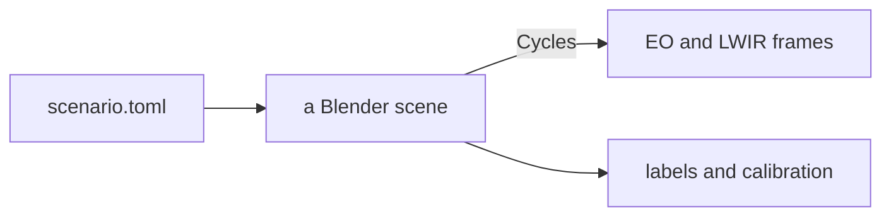

# How seascape works

seascape renders synthetic scenes at sea. You describe a scene in a TOML file (where the camera sits, the weather, which ships at what range) and it renders what an EO and a thermal camera would see, along with the answer key for every frame.

<p align="center"></p>

## What it's for

Labelling real footage is slow, and some things can't be labelled at all: the exact range to a ship, its bearing to a tenth of a degree, where the horizon really is. And you get whatever weather the day brings. In a synthetic scene you decide where everything goes and what the weather is, so the ground truth is exact and you can render the same scene again with one thing changed.

Training detectors on synthetic data is the obvious use, especially when real data is scarce (how well that transfers to real footage is untested so far). But that's not really what it's for. Mostly it's a way to get a good-enough picture of a situation, with all the ground truth attached, e.g.:

- mocking up a new product or a new combination of cameras
- seeing how mounting height changes what the cameras see
- testing distance estimation against exact ranges
- recreating tricky situations that are hard to stage at sea, like a collision course

Every frame comes with `labels.json` (a COCO box per target, with its range and bearing, plus where the horizon falls) and `calibration.json` (the camera's intrinsics and pose). The boxes come from a render pass that writes each target's ID into its pixels, so every box is tight to the target's visible pixels. [Outputs](../outputs.md) has the details.

## Limitations

seascape simplifies a few things on purpose. The main one is that waves are drawn by tilting the surface's shading rather than moving it, so a wave never hides a target or casts a shadow (the sea section explains why). The cameras are ideal, with no noise, distortion or rolling shutter, and the sky is either clear or a still photo. The LWIR is good for looking at and for regression tests, but it isn't a radiometric reference, so treat a detection range or contrast read off a render as a rough estimate.

## Rendering

seascape is a Python program that uses Blender as a library. Blender ships as a package, `bpy`, so seascape imports it like NumPy, builds the scene from nothing and renders it. Physics with a published source (waves, thermal emission, the thermal sky) is plain NumPy, tested without Blender, and the Blender side only turns those numbers into nodes.



Blender's renderer, Cycles, is a path tracer. For every pixel it fires rays into the scene, lets them bounce around like light would, and averages what comes back. Each ray is a sample, and a few samples make a noisy average:

<p align="center"></p>

Two ideas from shaders, the little programs that decide how a surface looks, do most of the work here. The *normal* is which way a surface faces as far as light is concerned, and a shader can tilt it without moving the surface. *Roughness* is detail too small to draw, treated as millions of tiny mirrors pointing slightly different ways.

Every render below the hero comes from [`primer.toml`](primer.toml), small enough for a laptop CPU, so you can poke at any of them:

```bash
uv run seascape render docs/primer/primer.toml -o out/ --set 'sea.wind_speed_mps = 14'
```

<details>
<summary>Five minutes in the Blender app</summary>

```bash
uv run seascape build docs/primer/primer.toml -o out/primer.blend
```

Open it in [Blender](https://www.blender.org/download/), hover over the 3D view and press <kbd>Numpad 0</kbd> to look through the camera, then <kbd>Z</kbd> → *Rendered*. The *Shading* tab shows the sea's node graph when you click the sea; switch *Object* to *World* in the node editor's header for the sky. Anything you change there is gone on the next build, so put it in the code.

</details>

## The sea

The obvious way to make waves in Blender is the Ocean modifier, which moves a mesh up and down. That works up close but shimmers in the distance, which is where a maritime camera spends most of its pixels. The camera sees the sea almost edge-on, so each pixel lands on it as a long thin strip:

<p align="center">
  <picture>
    <source media="(prefers-color-scheme: dark)" srcset="charts/footprint-dark.png">
    
  </picture>
</p>

A wave shorter than its pixel can't be drawn, only aliased. So the sea works out each pixel's strip from the camera, draws the waves longer than it by tilting the normal, and turns the rest into roughness. How rough in total comes from Cox & Munk, who photographed sun glitter from a plane in the fifties. You can see it in the sun's glitter, which widens with the wind:

<p align="center"></p>

## Thermal

A thermal camera sees the light that objects give off because they're warm. Everything glows a little, and warmer things glow more and at shorter wavelengths, so the sun lands in the visible and the sea in the band an LWIR camera sees:

<p align="center">
  <picture>
    <source media="(prefers-color-scheme: dark)" srcset="charts/glow-dark.png">
    
  </picture>
</p>

Same scene, both cameras:

<p align="center"></p>

The ship is warm. The clouds are warm too: a thick cloud glows at the temperature of the air at its base, while the clear sky between them is cold. The sea also acts as a mirror: water mostly glows like itself when you look straight down, and mostly reflects the sky as you look toward the horizon. That's why the waves show up even when sea and air are at exactly the same temperature (middle panel; each panel sets its own grey scale, like a thermal camera does):

<p align="center"></p>

Blender only knows red, green and blue, so all of this is NumPy: emissivity from measured optical constants of water, the sky from a standard atmospheric model. Blender just gets lookup tables.

## Haze and horizon

Two things happen as a ship gets farther away. The air scatters its light away and sky light in, so it fades into the sky:

<p align="center"></p>

And the earth curves away under it. From a 30 m mast the horizon is 21 km out, and past it a ship sinks hull-down:

<p align="center"></p>

<p align="center">
  <picture>
    <source media="(prefers-color-scheme: dark)" srcset="charts/hidden-dark.png">
    
  </picture>
</p>

That's it. From here: [Scenarios](../scenarios.md) to write your own, [Assets](../assets.md) for what you can put on the water, and [Contributing](../../CONTRIBUTING.md) plus [AGENTS.md](../../AGENTS.md) before you change anything. [`figures.py`](figures.py) and [`charts.py`](charts.py) redraw the renders and charts on this page.
