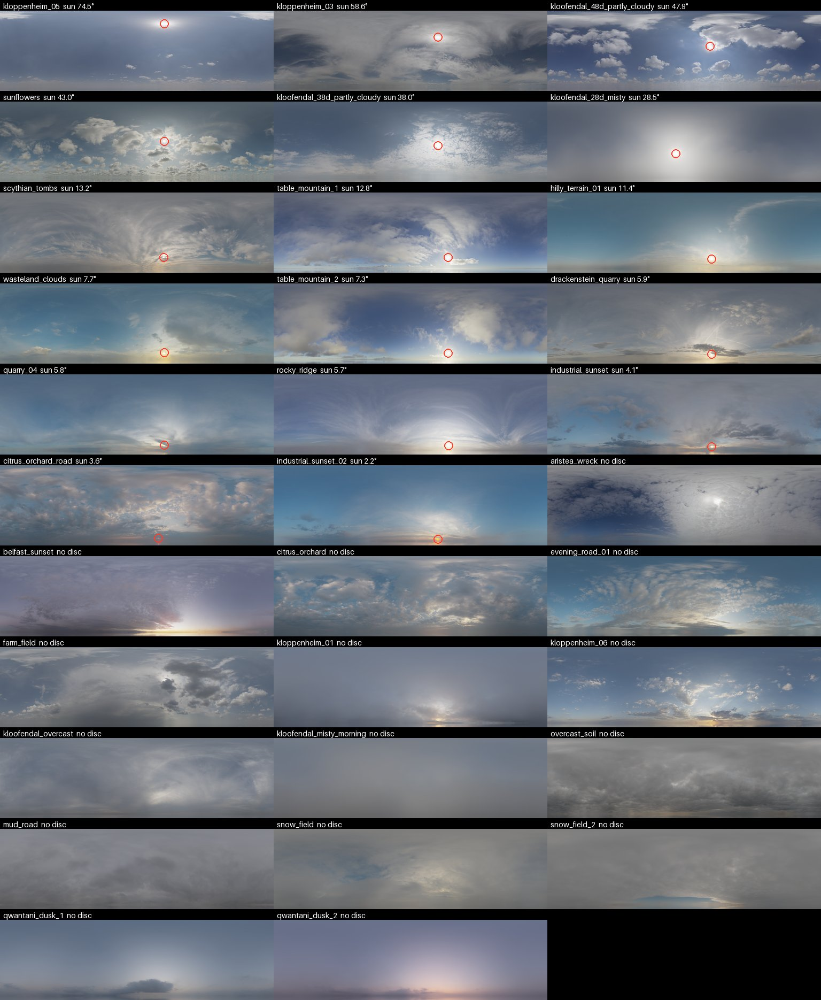

# Scenarios

A scenario is a TOML file describing the world, the platform, the sensors and the targets. `scenarios/baseline.toml` is the smallest one.

`--set` overrides any field for one run, as the TOML line it would be written as, presets included:

```bash
uv run seascape render scenarios/twin-pod.toml --set 'rigs.port.pitch_deg = -5'
uv run seascape render scenarios/baseline.toml --set 'outputs.samples.eo = 8' --set 'sky.sun_elevation_deg = 5'
uv run seascape render scenarios/baseline.toml --set 'rigs.bow.cameras.eo.hfov_deg = 30'   # one camera
```

A variant worth keeping is a file, and `extends` makes it a diff:

```toml
extends = "twin-pod.toml"

[rigs.port]
pitch_deg = -5.0
```

## Rigs and cameras

A rig is one installed product; a camera is its optics and its aim within the rig. Both are tables keyed by name, so `extends`, `preset` and `--set` change one of them and leave the rest; a camera's files are named `<rig>_<camera>`.

```toml
[rigs.bow]
height_m = 12.0

[rigs.bow.cameras.eo]
band = "eo"
hfov_deg = 45.0
width_px = 1920
height_px = 1080
```

A camera is a preset under `seascape/cfg/cameras/`: `preset = "evidir_640_18deg"`.

A product is a preset under `seascape/cfg/rigs/`; `scenarios/twin-pod.toml` installs two:

```toml
[rigs.port]
preset = "port"

[rigs.starboard]
preset = "starboard"
```

A table that names a preset replaces whatever it lands on, so `--set 'rigs.bow = { preset = "port" }'` turns the bow into a Pod; keys beside the `preset` still change it. Nothing else removes a rig or a camera: a scenario with fewer extends a narrower parent, as `twin-pod.toml` extends `port-pod.toml`.

Scenarios carry a `#:schema` line, so editors with a TOML language server give you key completion, inline validation and hover docs. `seascape schema > schema/scenario.json` regenerates it from the models.

## Randomization

Any field can be drawn instead of set: `{ uniform = [lo, hi] }` for a float, `{ integer = [lo, hi] }` for a whole number, both bounds included, `{ choice = [...] }` for one of several values, tables included. `weights` beside a choice makes it uneven: `{ choice = ["a", "b"], weights = [1, 4] }` draws `b` four times as often. A drawn table replaces the one it would merge with, so `[[sky.choice]]` picks between whole skies:

```toml
[rigs.bow]
pitch_deg = { uniform = [-3.0, 1.0] }

[[sky.choice]]
sun_elevation_deg = { uniform = [2.0, 60.0] }

[[sky.choice]]
hdri = { choice = ["belfast_sunset", "kloofendal_overcast"] }
```

A table set over a choice of tables goes into every option, so `--set sky.visibility_km=10` keeps the sky drawn and fixes only its visibility. [`scenarios/randomized.toml`](../scenarios/randomized.toml) is a fuller example.

An object's `count` makes that many, each drawn anew, and `heading_from = "line_of_sight"` turns its `heading_deg` from the line from the ownship to it, so 0 points away and 180 towards. [`scenarios/dataset.toml`](../scenarios/dataset.toml) draws its hulls that way.

`seed` decides every draw, and `--variants` renders consecutive seeds, each into a folder named for its seed when there are several. A seed whose hulls meet is skipped for the next:

```bash
uv run seascape render scenarios/dataset.toml --variants 8 -o out/
```

Each draw comes from a stream named for the field, so a new draw leaves the others as they were; a list item is named by its position. `labels.json` records the values drawn, under `info.scenario`.

## Skies

By default the sky is Blender's Sky Texture: clear, at any sun elevation down to twilight. `sky.hdri` puts a photographed sky in its place, one of Poly Haven's pure skies listed in [`seascape/skies.toml`](../seascape/skies.toml), fetched into the asset cache on first use. The photo turns so its sun sits at `sun_bearing_deg`. Its elevation is the one it was photographed at, so a scenario with `hdri` leaves `sun_elevation_deg` out. LWIR keeps its own clear sky and takes the photo's sun and clouds, each cloud a blackbody as warm as the air at `cloud_base_m`. A photo's radiance is in its own exposure, so an exr build compares only with builds of the same sky.

```bash
uv run seascape render scenarios/baseline.toml --set 'sky.hdri = "table_mountain_1"' --set 'sky.sun_bearing_deg = 20'
```

<p align="center">
  
  <br>
  <sub>The library, highest sun first, each sun circled where <code>seascape.skies</code> measures it (<a href="skies.py"><code>docs/skies.py</code></a>).</sub>
</p>

## Sequences

`outputs.duration_s` turns a scenario into a clip. Targets make `speed_mps` along their heading, the ownship follows `[ownship.roll]`, `[ownship.pitch]` and `[ownship.heave]`, and the waves, and the gusts that roughen them, run downwind from `sea.wind_from_deg`. `scenarios/underway.toml` has all three:

```bash
uv run seascape render scenarios/underway.toml -o out/   # out/<camera>/0000.jpg, ...
uv run seascape video out/                               # out/<camera>.mp4
```

`seascape recording` lays the videos out as a rig's `model` records them, so it takes a rig that names one, such as the Pod in `scenarios/port-pod-loop.toml`:

```bash
uv run seascape render scenarios/port-pod-loop.toml -o out/
uv run seascape video out/
uv run seascape recording out/                           # out/recordings/<rig>/<model>_recordings_<ts>/
```

`outputs.loop = true` makes a seamless clip: every period, each wave's included, rounds to a whole fraction of `duration_s`. A looping target cannot be underway; give it a `drift`, as `scenarios/drifting.toml` does.

Every frame has its own entry in `calibration.json` and `labels.json`, stamped with `time_s`. `seascape video` paces the frames by it, so a clip re-encodes without re-rendering. The `.blend` from `seascape build` carries the motion as keyframes. `montage` and `panorama` take stills.
